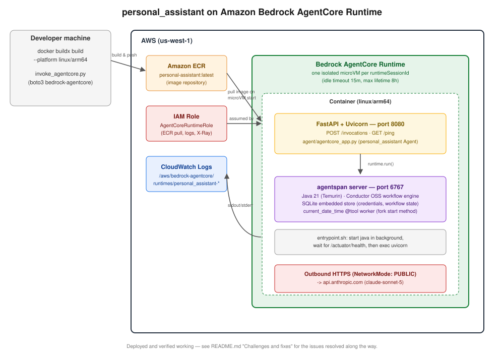

# AI Agent Project

Three standalone agents built on the [agentspan](https://github.com/agentspan-ai/agentspan) SDK (a Python framework for durable, tool-using LLM agents, built on Netflix's Conductor OSS workflow engine). One of them (`agent1.py`) has been productionized and deployed to **Amazon Bedrock AgentCore Runtime**.

## 1. Tech stack

| Layer | Technology |
|---|---|
| Language | Python 3.12 |
| Package manager | [uv](https://docs.astral.sh/uv/) |
| Agent framework | [agentspan](https://github.com/agentspan-ai/agentspan) (`Agent`, `AgentRuntime`, `@tool`, `@guardrail`, `ConversationMemory`) |
| Agent runtime engine | Conductor OSS (Java/Spring Boot), bundled inside the `agentspan` server |
| LLM | Anthropic Claude (`claude-sonnet-5`), via agentspan's model routing |
| Web tools | [Firecrawl](https://www.firecrawl.dev/) (search + scrape), used by `agent3.py` |
| Structured output / validation | Pydantic |
| API layer (deployed agent) | FastAPI + Uvicorn |
| AWS SDK | boto3 |
| Containers | Docker (multi-stage, `linux/arm64`), Eclipse Temurin JDK 21, SQLite (agentspan's embedded credential/workflow store) |
| Deployment target (live) | **Amazon Bedrock AgentCore Runtime** |
| Deployment target (scaffolded, not deployed) | AWS Lambda (container image) + DynamoDB + API Gateway |
| IaC | AWS CloudFormation (YAML) |

## 2. The three agents

### `agent/agent1.py` — `personal_assistant`
The simplest of the three: one `Agent`, one tool (`current_date_time`), a 5-message `ConversationMemory`, and a CLI REPL loop. **This is the agent that was productionized and deployed to AWS** — see [`agent/agentcore_app.py`](agent/agentcore_app.py) for the FastAPI-wrapped version that actually runs in the cloud.

### `agent/agent2.py` — `support_agent`
A customer-support bot demonstrating agentspan's structured-output, guardrail, and human-in-the-loop features:
- **Structured output** — responses are constrained to a `SupportResponse` Pydantic model (`stage`, `successful`, `message`) instead of free-form text.
- **Three tools** — `search_knowledge_base` (mock docs lookup), `lookup_order` (mock order DB), and `process_refund`, which is marked `approval_required=True`.
- **Guardrail** — `safe_support_request` blocks obvious prompt-injection phrases ("ignore previous", "jailbreak", etc.) before the prompt reaches the model.
- **Human-in-the-loop** — the driver loop streams `EventType` events and pauses on `WAITING`, printing the pending refund amount and order ID and asking the operator to approve or reject it before `process_refund` actually executes.

### `agent/agent3.py` — research & publishing pipeline
A multi-agent system with four selectable execution modes (`sequential`, `parallel`, `nested`, `worker`):
- **`researcher` → `writer` → `editor`** (`publish_pipeline`) — sequential pipeline. The researcher calls `search_web` / `fetch_page` (Firecrawl) and must end its output with a `## Sources` section; the writer and editor are instructed to preserve it verbatim.
- **`market_analyst` + `risk_analyst` + `financial_analyst`** (`analysis_team`) — three agents run in parallel and are synthesized into one brief.
- **`nested_pipeline`** = `analysis_team >> researcher >> writer >> editor` — the parallel analysis feeds into the sequential publish pipeline.
- Reports are rendered to markdown and saved under `reports/<mode>-<topic-slug>.md`.

## 3. Infrastructure (deployed for `agent1.py` → AgentCore)

| Component | Action |
|---|---|
| **Amazon ECR** repository (`personal-assistant`) | Stores the built `linux/arm64` container image (Docker `buildx build --push`). |
| **IAM Role** (`AgentCoreRuntimeRole`) | Trust policy lets `bedrock-agentcore.amazonaws.com` assume it; execution policy grants ECR pull, CloudWatch Logs, X-Ray, `cloudwatch:PutMetricData`, and workload-access-token permissions. Deliberately **no** `bedrock:InvokeModel` — the agent calls Anthropic's API directly, not an AWS-hosted model. |
| **Bedrock AgentCore Runtime** (`personal_assistant`) | Hosts the container. `NetworkMode: PUBLIC` (outbound internet for the Anthropic API call). Lifecycle: 15 min idle timeout, 8 h max session lifetime. Each `runtimeSessionId` gets its own isolated microVM that survives idle periods — this is what lets in-process `ConversationMemory` work across conversation turns without an external database. |
| **CloudWatch Logs** (`/aws/bedrock-agentcore/runtimes/personal_assistant-*`) | Captures the container's stdout/stderr — the only way to see tracebacks, since `InvokeAgentRuntime` hides them from the API response. |
| **Container** (two processes, one image) | `agentspan` server (Java 21, port 6767, embedded SQLite) started in the background by [`docker/agentcore/entrypoint.sh`](docker/agentcore/entrypoint.sh); FastAPI/Uvicorn (port 8080, `/invocations` + `/ping`) in the foreground, talking to it over `localhost`. |
| **CloudFormation stack** ([`docker/agentcore/stack.yaml`](docker/agentcore/stack.yaml)) | Declares the ECR repo + IAM role + Runtime resource. Deployed in two passes, since CloudFormation can't build/push a Docker image itself. |
| `deploy_agentcore.py` / `invoke_agentcore.py` | boto3 scripts for creating the runtime and testing it end-to-end. |

Not deployed, kept as a design alternative: an AWS Lambda (container image) path — [`Dockerfile`](Dockerfile), [`template.yaml`](template.yaml), [`agent/lambda_handler.py`](agent/lambda_handler.py) — using DynamoDB for session memory instead of in-process state, since Lambda containers don't get AgentCore's session-to-microVM affinity guarantee.

## 4. Architecture diagram

[View the architecture diagram](docs/architecture.svg)



## 5. Challenges and fixes hit during this deployment

1. **`PicklingError` starting tool workers** — `agentspan`'s `@tool` decorator wraps functions in a closure whose `__module__` doesn't match where it's actually defined, and `conductor-python` (agentspan's task-runner dependency) forces multiprocessing's `spawn` start method at import time. Under `spawn`, worker processes are started by pickling the tool function *by reference*, which fails. **Fix:** call `multiprocessing.set_start_method("fork")` before importing `agentspan` — `fork` copies the whole process instead of pickling, sidestepping the bug. Needed independently in `agent1.py`, `agent3.py`, `agentcore_app.py`, and `lambda_handler.py` (missed it once in `agentcore_app.py` and hit the identical crash a second time inside the deployed container).
2. **Three logic bugs in the original `agent1.py`** — `datetime().now()` (instantiating `datetime` before calling `.now()`, instead of calling it as a classmethod), a redundant `runtime=runtime` kwarg on an already-bound `runtime.run(...)` call (silently ignored with a warning), and `result.output.get(readable_result)` using the *answer text itself* as a dict key instead of printing it, which always printed `None`.
3. **Firecrawl tool credentials never resolved** — `agentspan` 0.2.0's `@tool(credentials=[...])` requires a server-minted "execution token" that this SDK version never actually obtains under `run()`, so it always failed with *"No execution token available"* regardless of whether the secret was registered on the agentspan credential server. **Fix:** dropped `credentials=[...]` and read `FIRECRAWL_API_KEY` from a plain environment variable instead (which the tool functions already did internally).
4. **`docker buildx: unknown flag: --platform`** — Docker Desktop was installed but not running; its CLI plugins (including `buildx`) only get linked into `~/.docker/cli-plugins/` on launch. Fixed by starting Docker Desktop.
5. **`UnsupportedClassVersionError` at container startup** — the official `agentspan/server` jar is compiled for Java 21 (class file version 65), but Debian bookworm's `apt` repos only carry OpenJDK 17. **Fix:** multi-stage-copy the JDK straight out of `eclipse-temurin:21-jre` instead of `apt-get install`-ing one.
6. **`update-agent-runtime` silently wiped the Anthropic key** — AgentCore's update API *replaces* the full resource configuration rather than merging it; omitting `--environment-variables` on an update cleared `ANTHROPIC_API_KEY`, and the container logged *"No AI provider API keys configured"*.
7. **422 on `/invocations` despite a valid JSON body** — `invoke_agent_runtime` needs an explicit `contentType="application/json"` (and `accept`); without it, AgentCore didn't forward a `Content-Type` header the container's FastAPI app would auto-parse as JSON, so a perfectly valid payload failed request validation.
8. **A debug handler added to diagnose #7 introduced its own bug** — it tried to JSON-serialize the raw request body (`bytes`) inside a Pydantic validation-error payload, turning a 422 into an unrelated 500. Removed once the real cause (`contentType`) was found.

## 6. Running the agents locally

All three need a local `agentspan` server reachable at `AGENTSPAN_SERVER_URL` (`.env`, defaults to `http://localhost:6767/api`) and `ANTHROPIC_API_KEY` available to it — either exported in your shell or registered with `agentspan credentials set ANTHROPIC_API_KEY <key>`. Check the server's up with:
```bash
curl http://localhost:6767/actuator/health
```

### `agent1.py` — personal_assistant
```bash
uv run agent/agent1.py
```
```
Starting Agent ..
You what time is it?
Assistant: It's currently **7:05:42 PM** on **September 4, 2026**.
You q
```

### `agent2.py` — support_agent
Also needs no extra tool credentials (its "tools" are in-memory mocks). The refund tool pauses for approval — answer the `y/n` prompt when it appears:
```bash
uv run agent/agent2.py
```
```
Support bot starting....
You: what is your refund policy

{'stage': 'answering_policy_question', 'message': "Our refund policy: refunds are processed within 5 business days of approval. If you'd like to request a refund for a specific order, please provide the order ID so I can look it up.", 'successful': True}

You: I want a refund for order A100

Approval required: refund $49.99 for order A100
Approve? (y/n): y

{'stage': 'refund_processed', 'message': "I have refunded $49.99 for order A100. Your refund has been processed successfully. Please allow a few business days for it to appear on your original payment method. Let me know if there's anything else I can help with!", 'successful': True}

You: q
```

### `agent3.py` — research & publishing pipeline
Also needs `FIRECRAWL_API_KEY` (plain env var — see [challenge #3](#5-challenges-and-fixes-hit-during-this-deployment)):
```bash
uv run agent/agent3.py
```
```
Mode ['nested', 'parallel', 'sequential', 'worker']: sequential
Topic: amazon stock
Execution ID: f0fb1af4-7208-4910-8d41-04455f4f36cb
Status: COMPLETED
Report saved to reports/sequential-amazon-stock.md
```
`reports/sequential-amazon-stock.md` contains the full article with a real `## Sources` section of fetched URLs.

## 7. Running `agent1.py` in production (AgentCore)

Once deployed (see section 3), invoke it with `invoke_agentcore.py` — no local `agentspan` server or `ANTHROPIC_API_KEY` needed on your machine, both live inside the deployed container:
```bash
export RUNTIME_ARN=arn:aws:bedrock-agentcore:us-west-1:<ACCOUNT_ID>:runtime/personal_assistant-GGhumE4DHg
export SESSION_ID=test-session-$(uuidgen | tr 'A-Z' 'a-z')

uv run invoke_agentcore.py "What time is it?"
```
```
Assistant: It's currently **9:00 PM (21:00:35)** on **September 6, 2026**.
```
Reusing the same `SESSION_ID` proves the session-scoped memory (section 3) actually works — repeat calls land on the same warm microVM:
```bash
uv run invoke_agentcore.py "My name is Naveen, remember that."
uv run invoke_agentcore.py "What is my name?"

```
```
Assistant: Got it, Naveen — I'll remember that.
Assistant: Your name is Naveen.
```

## 8. Miscellenous

All the expalnation for the code has inline comments in the code base for agent1.py, agent2.py and agent3.py
I made the decisions to go wth BedRockAgent because it provides off the shelf configuration for deploys. 
